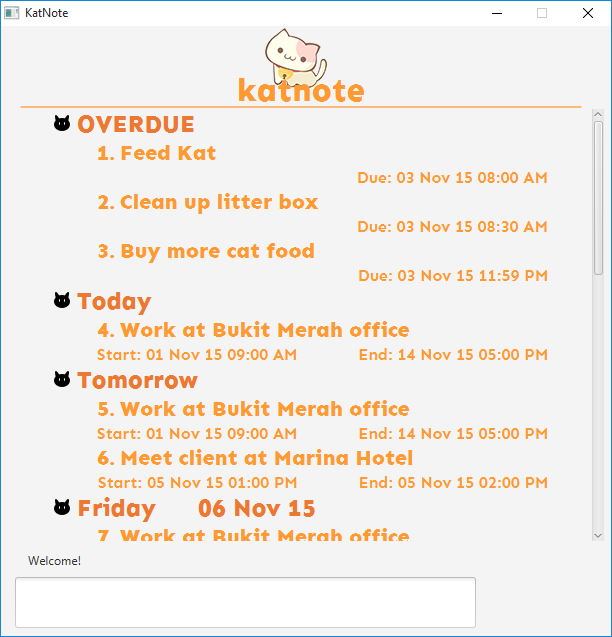

# KatNote

Welcome to KatNote!
KatNote is a scheduling application that aims to help busy individuals to plan their schedule easily. Using KatNote is fast and efficient. It allows you to plan and view your schedule entirely using the keyboard alone. This saves you from the hassle of having to click on multiple buttons just for a simple command. Moreover, KatNote is fully functional offline, which means you can manage your schedule anywhere, anytime. Lastly, KatNote is also smart; it can understand your commands without enforcing rigid command formats. 
Next, let us help you quickly get started on using KatNote!

**Want to use KatNote?**
* [Download the latest release](https://github.com/cs2103aug2015-t09-2j/main/releases) 
* [**User Guide**](docs/User-Guide.md)
* [**Detailed Command Format**](docs/Detailed-Command-Format.md)

**Want to contribute to KatNote?**
* [**Developer Guide**](docs/Developer-Guide.md)
* [Dev Environment Setup](docs/Development-Environment-Setup.md)
* [Learning Resources](docs/Learning-Resources.md)